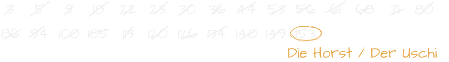
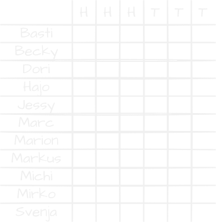
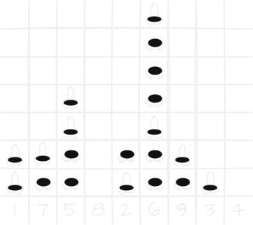
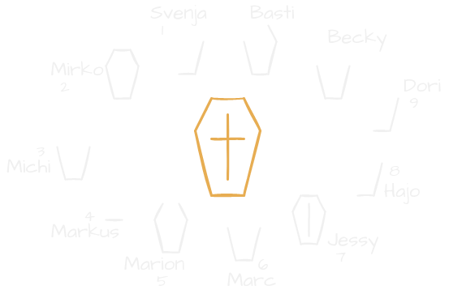

= Tafelboy
// https://revealjs.com/themes/
:revealjs_theme: night
:revealjs_hash: true
:revealjs_overview: false

++++

++++

Gewidmet dem Chef-Anschreiber des erhabenen Kegelclubs der Moselblümchen.

// todo -> Chalk image generators / tools
// https://photofunia.com/effects/chalkboard

// todo -> Build custom theme with blackboard image as bg

// todo -> Horst und Uschi?? Wie in die Grafiken einbauen?? Als Spielernamen??

== Ein fest vergebenes Amt
Das Beanspruchen des Platzes vorne rechts direkt an der Tafel hat die Stellung des Chef-Anschreibers derartig zementiert, dass ein Kegeln ohne ihn faktisch nicht mehr möglich ist.

== Die Begeisterung wird bereits früh geweckt
Die Qualitäten an Kreide und Tafel hat sich der Chef-Anschreiber bereits zu Schulzeiten angeeignet. Regelmäßiges Freiwillig-Melden zum Tafeldienst und den Lehrern ihre Tasche tragen gehörten zu den Kernaufgaben dieser bereits im Kindesalter begonnenen Ausbildung.

== Das Repertoire
Im folgen ist ein Auszug aus dem Repertoire zu finden ...

== Horst & Uschi

Wer als erster die 150 Punkte überschreitet, verliert für den Abend seinen Namen

== Hohe & Tiefe Hausnummer

== Vier gewinnt
Auch bekannt als Pimmelchen gegen Tittchen oder (ein wenig jugendfreier) Jungs gegen Mädels :-)

== Sarg Spiel
Oder "alle gegen Basti" ... die Nummern machen deutlich wer der Gegner in diesem Spiel ist

